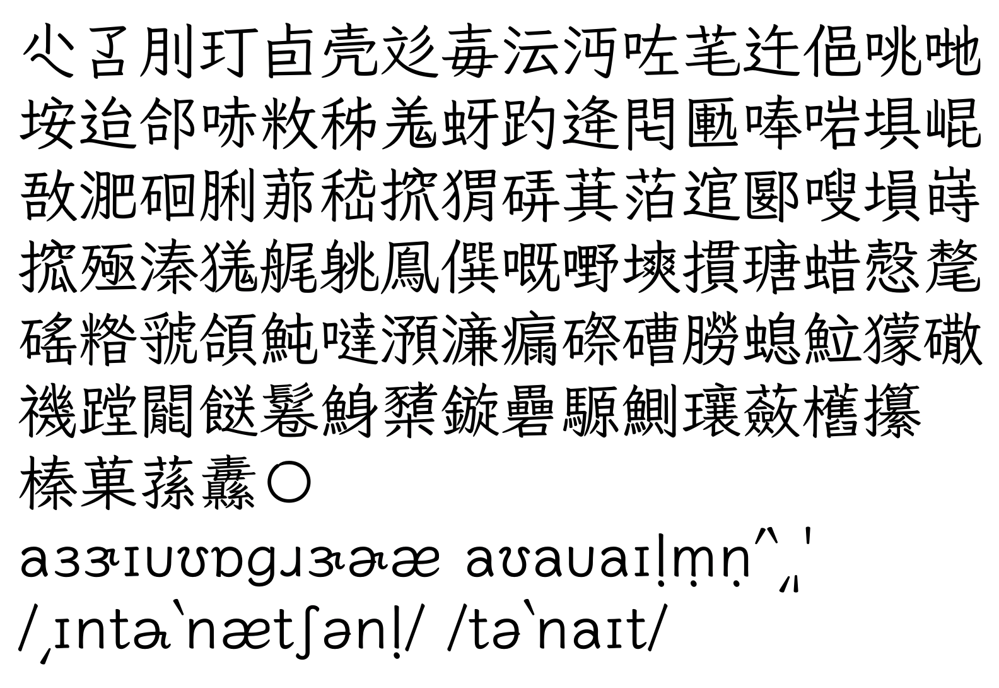
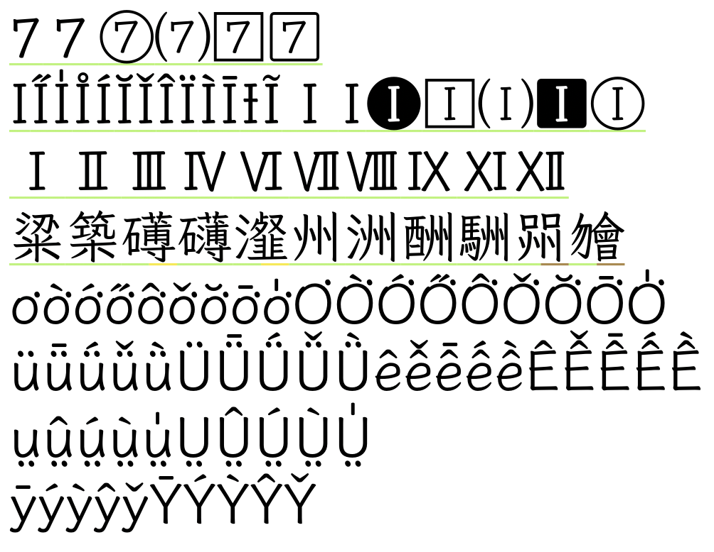

# 異動紀錄

## 2022/4/24 v0.943

- 新增21字（灃玗芠禕玹吖諼鶘儸唰枒芩衹婧屨岭菈躥仉揸旼）

## 2022/2/24（國際討厭香菜日） v0.941

- 新增1個人名漢字（妡）與12個粵語字（噃㗎𡃁啩嚿嗰噚啫嘥諗瞓攰）
- 修改漢字寫法（亹衊韈）
- 英文字型名稱嘗試拿掉點（試試看能不能相容某些軟體）
- 嘗試調高 hheaLineGap（在 macOS 上加大行距，不影響 Windows）

## 2022/2/11 v0.931

- 新增4個人名漢字（㛢楀琋瑀）
- 修正「盦」字錯誤

## 2022/2/2 v0.930

- 新增95個漢字（台灣鄉鎮市村里等地名用字、立法委員與縣市長姓名用字、部分來自 issues 建議的補字、部分粵語用字）：尐叾刖玎卣壳彣毐沄沔咗芼迕俋咷哋垵迨郃哧敉秭羗蚜趵逄𨳍匭唪啱埧崐敔淝硘脷𦰡嵇𢱑猬硦萁萡逭郾嗖塤嵵搲殛溱獇艉䠷鳯僎嘅嘢塽摜瑭蜡慤氂磘糌虢頜魨噠澦濓瘺磜𥕢朥螅𩶘獴䃟禨蹚𨶙餸鬈鯓櫫鏇礨騵鰂瓖蘞欍攥
- 修正4個漢字：榛菓蓀纛（遵循標準字體）
- 數字造形〇比照數字0，加上運筆感
- 修改 palt、vpal 比例寬特性，在 Adobe 軟體選擇以比例寬排版時，括號位置較為正確
- 補齊 KK 音標、DJ 音標需要之所有字母、重音標號，可從下表複製使用： 

	- KK: ɑæɛəɪɔᴜʌɚɝ aɪaᴜ θʃðʒŋḷṃṇ ‵ʹ͵
	- DJ: ɑæəɜɪɔʊʌː aɪaʊ θʃðʒŋ ˈˌ
	- 注意因為芫荽的 a 預設是單層，而 Unicode 沒有兩層 a 的字碼，故以標準連字方式來實作。當 a 出現在 ɪᴜʊ 之前時顯示為兩層。故單層 a 也可以不用刻意輸入 ɑ。

## 2022/1/22 v0.920

- 修正漢字 粱、築、礡、礴、瀣、州、洲、酬、駲、喌（遵循標準字體）
- 新增台語常見異用字 𣍐 (U+23350)
- 修改數字 7 造型符合國小課本習慣（但數字 1 不做修改，以免與小寫 l 混淆）
- 修改大寫字母 I 符合學校英文造型，並易與小寫 l 區別（同時修改台羅等各種帶有調號的 I、羅馬數字的 I）
- 微調台羅傳統版、白話字 o͘ 右上點的距離，避免小字時沾黏。
- 支援漢語拼音 üǖǘǚǜÜǕǗǙǛêê̄ếê̌ềÊÊ̄ẾÊ̌Ề（亦用於通用拼音）
- 支援客語白話字 ṳṳ̂ṳ̀ṳ́ṳ̍ṲṲ̂Ṳ̀Ṳ́Ṳ̍
- 支援馬祖福州語拼音 ȳýỳŷy̌ȲÝỲŶY̌
- 刪除 vrt2 屬性、並刪除旋轉字符，半形字符的直排旋轉改為遵從 UAX#50 或排版軟體的原則處理。

## 2022/1/12 v0.910

- 修正 emdash (U+2014) 零寬度的問題
- 修正 逢、途、遼、畬 4個字（遵循標準字體避捺或避鉤）

## 2022/1/11 v0.900 公開
