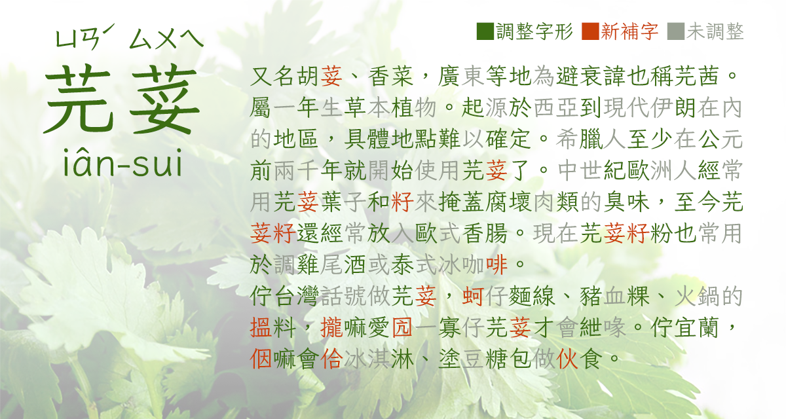

# 芫荽 / iansui
An open source Chinese font derived from Klee One (Fontworks). 

基於 Fontworks 的 Klee One 衍生的開源繁體中文字型。  

## 簡介

Fontworks 的 Klee（クレー）字型原本內建於 macOS，因其兼具楷體筆調、又似仿宋整齊端正，具高易讀性與溫暖外形，廣受中文使用者喜好。然而畢竟是日文字型，雖然字數不少，但排中文時仍有一定程度缺字，一直是可惜之處。

但 2020 年底，Fontworks 忽然以開源授權釋出了 Klee One 字型，震驚字型圈。網路上已有許多其他專案嘗試為 Klee One 補上中文字，如簡體中文補字的 [LXGW WenKai / 霞鹜文楷](https://github.com/lxgw/LxgwWenKai) 與傳統字形補字的 [Klee One 繁體中文版](https://dorawei.xyz/klee-one-tc/) 等。

此專案「芫荽」則是嘗試**盡可能**調整字形貼近教育部標準字體，並補充台客語用字，貼近台灣需求，並適合學齡教育使用（如童書、國字習作等）。

由於原 Klee 的 Regular 偏細而預估使用需求較低，本專案以原 SemiBold 為底製作。

## 最新版本與下載方式

目前最新版本為 0.943，請[點此](ChangeLog.md)查看詳細異動紀錄。

請點選本頁面右側「[Releases](https://github.com/ButTaiwan/iansui/releases)」處的最新發行版本，下載 iansui.zip。解壓縮後安裝裡面的 .ttf 字型檔案即可。

## 收錄字數

* Big5範圍內約7,800字。**注意並沒有包含Big5完整的13,560字。**
* 台、客語漢字（教育部《[臺灣閩南語常用詞辭典](https://twblg.dict.edu.tw/holodict_new/)》《[臺灣客家語常用詞辭典](https://hakkadict.moe.edu.tw/cgi-bin/gs32/gsweb.cgi/login?o=dwebmge&cache=1641872312920)》內所有推薦用字。原則上不收錄異用字。）、常用粵語字。
* 注音符號與方音符號。
* 支援台羅拼音、台語白話字拼音、客語拼音、客語白話字拼音、原住名族語拼音、漢語拼音、馬祖福州話拼音編排。
* 依繁體中文習慣，全形標點符號置中。括弧引號類亦調整為稍比日文原形向中靠攏。
* 數字 ７、英文大寫字母 I 亦調整為更貼近台灣教科書的寫法。
* 支援 KK 音標、DJ 音標 KK 音標、DJ 音標需要之所有字母、重音標號，可從下表複製使用： 
	- KK: ɑæɛəɪɔᴜʌɚɝ aɪaᴜ θʃðʒŋḷṃṇ ‵ʹ͵
	- DJ: ɑæəɜɪɔʊʌː aɪaʊ θʃðʒŋ ˈˌ
	- 注意因為芫荽的 a 預設是單層，而 Unicode 沒有兩層 a 的字碼，故以標準連字方式來實作。當 a 出現在 ɪᴜʊ 之前時顯示為兩層。故單層 a 也可以不用刻意輸入 ɑ。
	- 

## 字形調整原則

本字型**盡可能**調整字形貼近教育部標準字體，包括印刷體形式的斷筆，也都調整為一筆劃。
保留與 Klee 原封不動的字符約僅 3000 字（含調整過異體映射者），超過 4000 字符經過修改，並補字超過 1600 字。

開發時參考《[國字標準字體研訂原則](https://language.moe.gov.tw/001/upload/files/site_content/m0001/biau/c12.htm?open)》之規定，但《[國字標準字體教師手冊](https://language.moe.gov.tw/001/Upload/files/SITE_CONTENT/M0001/STD/c4.htm?open)》部分所述之部分規定不見於通則與分則，先不考慮處理。
因個人審美、人力等因素，以下細節目前決定不修改，或可能與標楷體有些許差異。

* 「又」字不閉口。（標準字體研訂原則規定又字閉口，但又字數量太多，且又第二筆做點時，閉口造形難以處理又不美觀。）
* 「攵」字閉口。（配合 Klee 原始造形設計）
* **不嚴格處理筆劃是否接觸**，如宀、立、羊等字的點是否與下橫接觸等。「𧘇」部件亦保留 Klee 的左右接觸設計。
* 日、目、田⋯⋯等字的右下角閉口方式，目前均保留 Klee 原始設計（比照「口」），相關文字實在太多，無法全面修改。
* 「糹」做為左偏旁時，最左點的方向與標楷體不同，此為美觀考量。此字體中宮鬆較正方，三點均朝右難以站穩。如同「灬」，連續的點，最左方點朝左或朝右，應視為審美選擇。
* Klee One 原有收錄的字，但在 Big5 範圍外且非台客語漢字者，原則上先視為日文異體，保留原字形不進行調整。

即本專案以較寬鬆的方式解釋教育部標準字體的規定，如同思源宋體、思源黑體、蘋方等其他字型。
這樣的寫法是否已足夠應付學齡教學使用，盼大眾能提供反饋。

## 注意

1. 本字型目前尚為 Beta 測試版本，若發現有字符出現外框錯誤，請在 issues 回報，謝謝。
2. 部分文字是否符合教育部標準字體標準可能見仁見智。
3. 因人力有限，目前沒有計畫製作完整 Big5 字集甚至更多 Unicode 漢字。若有缺字，可考慮與 [霞鹜文楷](https://github.com/lxgw/LxgwWenKai) 等其他 Klee One 的中文補字專案混排使用。但無法保證為標準字體。

## 開源授權規定

* 本字型基於 SIL Open Font License 1.1，改造 Fontworks 發佈的 [Klee](https://github.com/fontworks-fonts/Klee) 開源專案。
* Klee 是 Fontworks 的商標。
* Iansui、芫荽 是本專案的保留名稱。
* 任何人可以無償使用此字型，包含商用。無須告知原作者。
* 您可自由傳送、分享此字型，或與其他軟體綑綁發行、銷售。捆包中必須同時包含授權文件檔（OFL.txt）。
* 您可自由改造、衍生此字型並公開。修改後的字型必須同樣以 [SIL OFL](https://scripts.sil.org/OFL) 進行發佈，並請勿使用字型的保留名稱。
* 依照 [SIL OFL](https://scripts.sil.org/OFL) 規定，**禁止單獨出售字型檔(ttf/otf)**。

## 芫荽家族

- [注音芫荽](https://github.com/ButTaiwan/bpmfvs) 芫荽的注音字型。
- [字咍芫荽](https://github.com/ButTaiwan/taigivs) 台語標音字型家族。

## 相關資料

- [Fontworks 株式会社](http://fontworks.co.jp) 提供原版字型： [Klee GitHub Page](https://github.com/fontworks-fonts/)
- [LXGW WenKai / 霞鹜文楷](https://github.com/lxgw/LxgwWenKai)
- [國字標準字體研訂原則](https://language.moe.gov.tw/001/upload/files/site_content/m0001/biau/c12.htm?open)
- [國字標準字體教師手冊](https://language.moe.gov.tw/001/Upload/files/SITE_CONTENT/M0001/STD/c4.htm?open)

## 請斗內QQ

個人維護開源字型工程浩大，有足夠的支持，才有持續改版、精進的空間。若您覺得此字型能幫助到您，麻煩贊助一下吧Q_Q

信用卡（含國際信用卡）、超商條碼、超商代收，請 [點這裡](https://p.ecpay.com.tw/930AED7) 。
